# OpenShift Lab


Duration: 30 minutes


##  Introduction

During this lab, we are going to set up your laptop to be prepared to all labs during this workshop. You should be able to connect to an **OpenShift** Cluster thru the Web Console and navigate thru the different kubernetes resources.

The instructor has already built an OpenShift Cluster version 4.x for you. 


As you can see on the picture, you will connect to the OpenShift Cluster Web UI to the Master VMs for management and development purposes. The end-users will connect to the applications thru the Nodes.


## Task #1 - IBM Cloud account

The OpenShift platform that we are going to use has been built on IBM Cloud. 

```http
https://cloud.ibm.com
```

Type your **User ID** / **password** and click Login button given by the **instructor**:


You should see the following **Dashboard**:

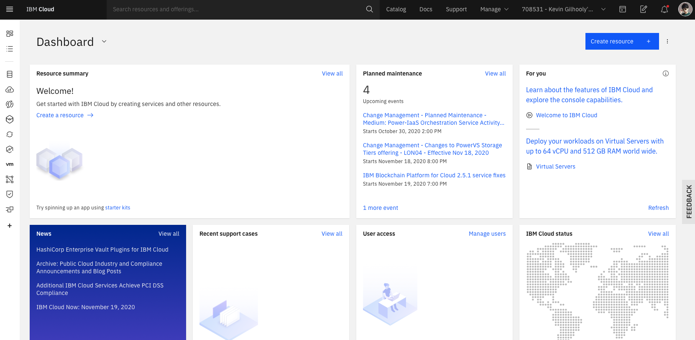


The instructor will also give you a project name like **labproj<xx>**. Each person has its own  project with a specific number <xx>.

> Please use that project that has been assigned to you during all labs.


## Task #2 - Connecting to the OpenShift Console


The instructor should have authorized you to get access to the **Kevin** Account. On the top right of the screen, click your name and then you should see the Kevin's account (click on the Kevin's account):


Then, the following page should appear (with **one cluster**)

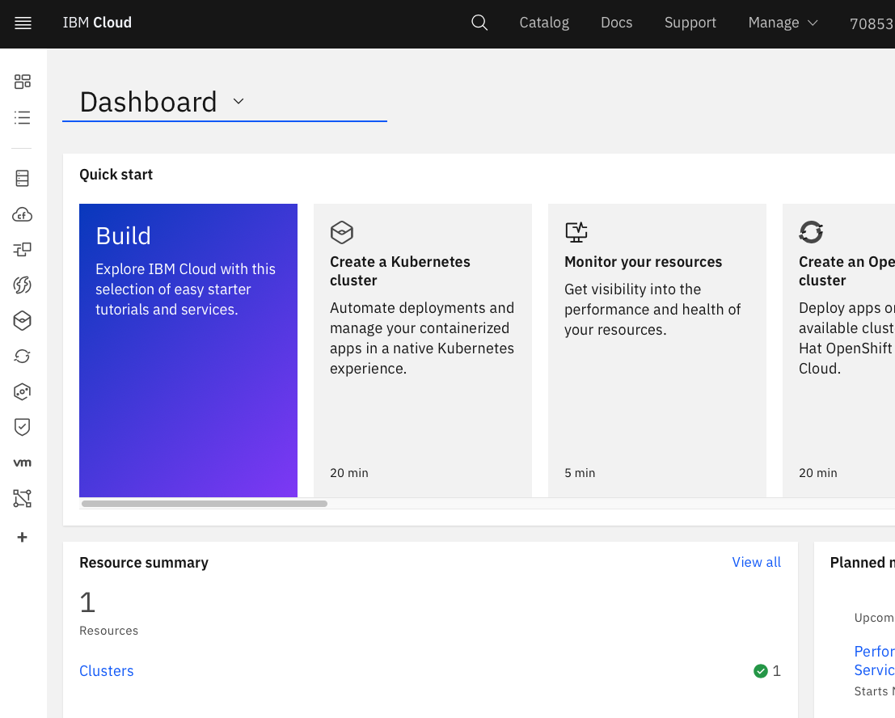

Click on **Clusters** to show the list:

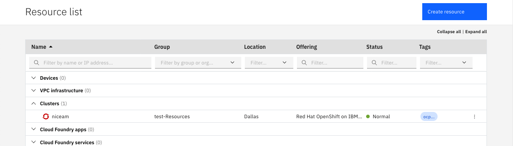


And then click on the cluster to see details about that cluster:

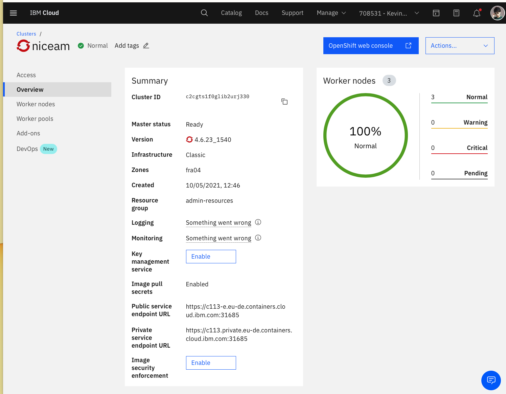

From this point, you can navigate on that cluster and look about some details like the version, the cluster ID, the zones, and the ingress subdomains. 

Then click on the worker nodes on the left pane to see the workers:

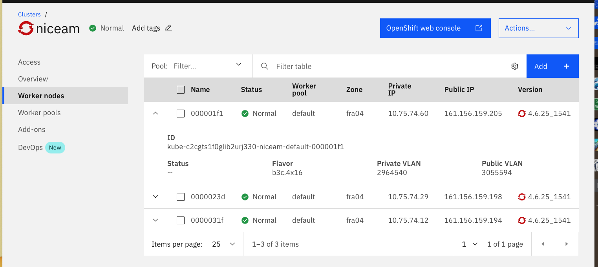

To get access to the OpenShift console click on the **blue button** (OpenShift web console) and a new tab should open:

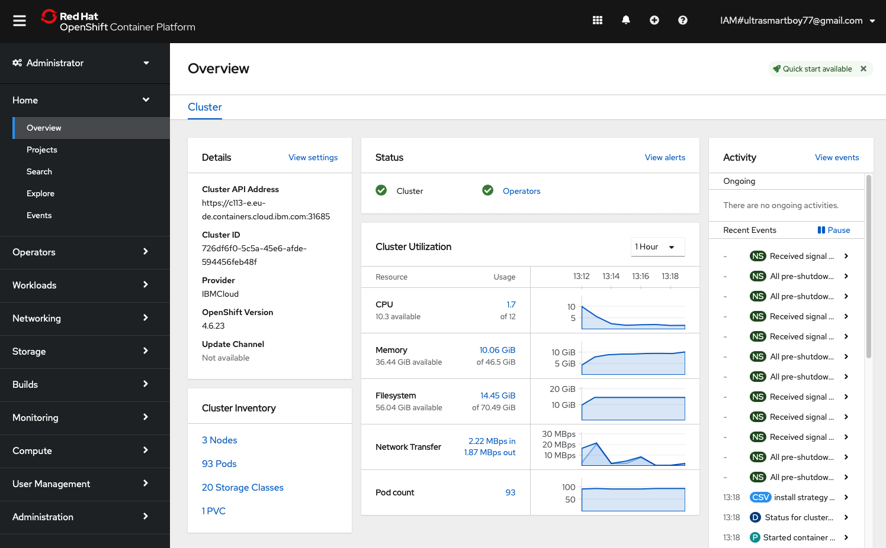


> Please take a note of the link because we will use it very often.

Of course you can navigate in the console and switch between the 2 profiles : Administrator and Developer 

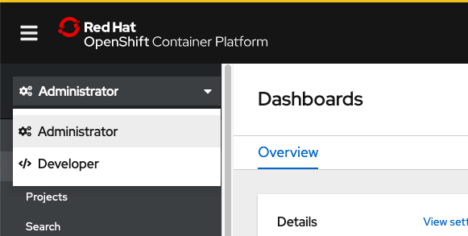


##  Task #3 - Installing the OpenShift CLI

In fact, you will need to use the **oc** command during the labs. 

From the top of the page, locate and click the **interrogation mark** and the **Command line tools**:


Locate the section concerning the OpenShift CLI:

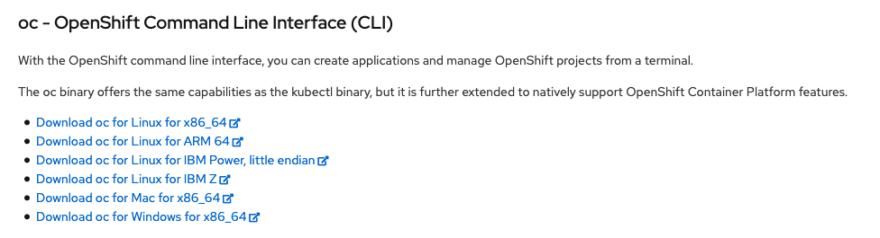

Choose the link concerning your OS running on your lap top. This will download the **right oc** version corresponding to right version of OpenShift.

If you use **Windows**, install the `oc` CLI in any directory that is listed in your `PATH`  system variables. This setup saves you some file path changes when you run commands later.

If you use **MacOS** or **Linux**, complete the following steps to add the binaries to your `PATH` system variable. 

1. Extract and move the `oc`  executable files to the `/usr/local/bin` directory.

   ```
   mv /<filepath>/oc /usr/local/bin/oc
   ```

2. Make sure that `/usr/local/bin` is listed in your `PATH` system variable. The `PATH` variable contains all directories where your operating system can find executable files. The directories that are listed in the `PATH` variable serve different purposes. `/usr/local/bin` is used to store executable files for software that is not part of the operating system and that was manually installed by the system administrator.

   ```
   echo $PATH
   ```

   Example CLI output:

   ```
   /usr/local/bin:/usr/bin:/bin:/usr/sbin:/sbin
   ```


### Task #4 - Check the OC command

To use the oc command, you normally need to use a login with user and password or a token.

From the web console, click on the user ID on the top right part of the console and pick **Copy Login Command**:


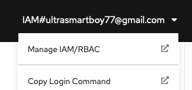

A new tab will open shortly:


Click on **Display Token** and you can see an example of the login command (this command will be available for the next 24 hours):

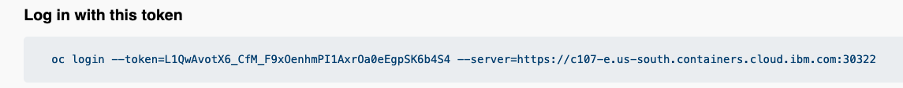


Open a **terminal** or a command line console and paste the previous command:

```shell
oc login --token=L1QwAvotX6_CfM_F9xOenhmPI1AxrOa0eEgpSK6b4S4 --server=https://c107-e.us-south.containers.cloud.ibm.com:30322
```

Result as an example:

```shell
oc login --token=L1QwAvotX6_CfM_F9xOenhmPI1AxrOa0eEgpSK6b4S4 --server=https://c107-e.us-south.containers.cloud.ibm.com:30322
Logged into "https://c107-e.us-south.containers.cloud.ibm.com:30322" as "IAM#ultrasmartboy77@gmail.com" using the token provided.

You have access to 68 projects, the list has been suppressed. You can list all projects with 'oc projects'

Using project "labproj99".
```

> **You don't need to create a new project because a new secure project space has already been created for you.** 


To switch to **your project** replave XX with your number:

``` bash
oc project labproj<XX>
```

Results as an example:

```shell
oc project labproj99
Already on project "labproj99" on server "https://c107-e.us-south.containers.cloud.ibm.com:30322".
```


To understand what project you are using:

```
oc projects
```

Results:

```shell
oc projects
You have access to the following projects and can switch between them with 'oc project <projectname>':

    calico-system
    default
    ibm-cert-store
    ibm-system
    kabanero
    kappnav
    knative-serving
    knative-serving-ingress
    kube-node-lease
    kube-public
    kube-system
  * labproj99
    multicluster-endpoint
    niceam-cluster
    ...
    tekton-pipelines
    tigera-operator

Using project "labproj99" on server "https://c107-e.us-south.containers.cloud.ibm.com:30322".
```


Now you are ready to go thru the exercises. 


## Task #5 - Deploy some code

Now go back to the Web UI and deploy your first application.

Switch to the **Developer** profile 

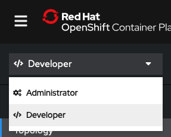

And then click on **Topology**:


Select on your project name (labprojxx): 

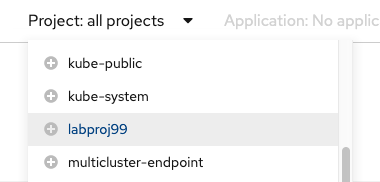


The following sceen should appear (no resources found):

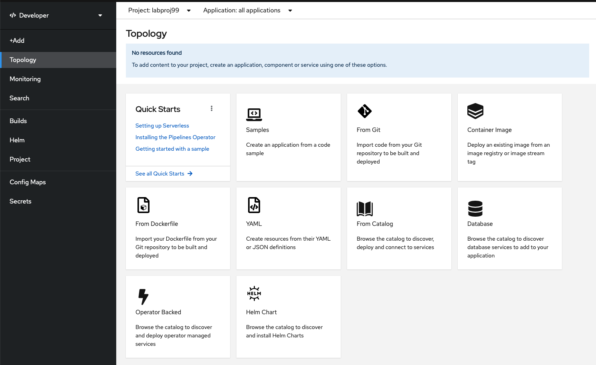


On the **From catalog**, find the **Node.js** tile (uncheck the Operator Backed):

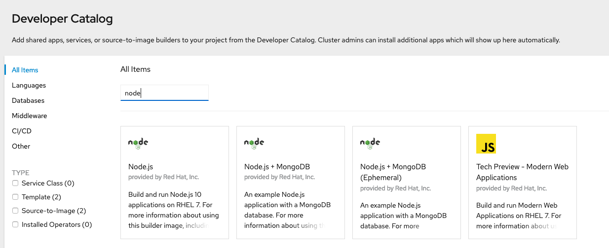

Select **Node.js** entry and then click on **Create Application** button

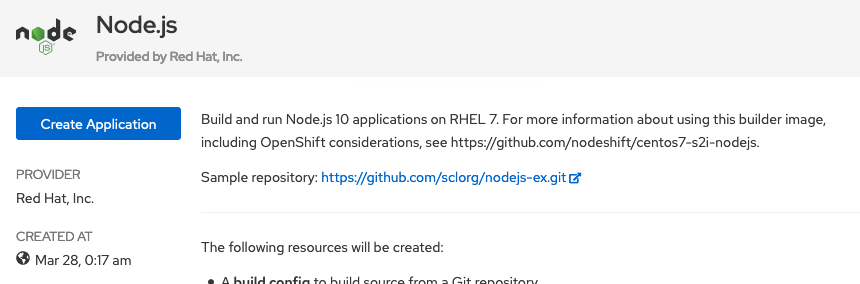


The following resources will be created:

- A build config to build source from a Git repository.
- An image stream to track built images.
- A deployment config to rollout new revisions when the image changes.
- A service to expose your workload inside the cluster.
- An optional route to expose your workload outside the cluster.

You can have a look to the github **sample** repository. 

``` http
 https://github.com/sclorg/nodejs-ex.git
```


You can see that the builder (S2I) is version 12 for Node.js in the **build section**.

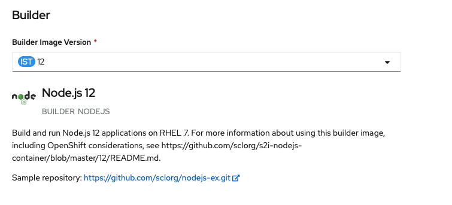

In the **Git section**, click in the **Try Sample** so you get the sample git repo URL filled in:

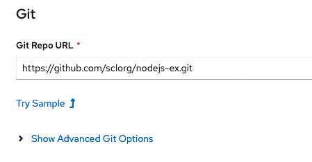


Then in the General section, names are already there:

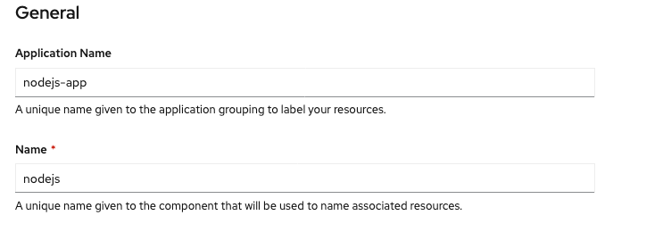


Go to the bottom and click **Create**

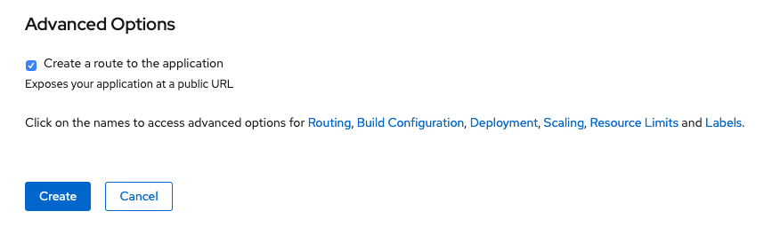

After a few seconds, the new application has been created:

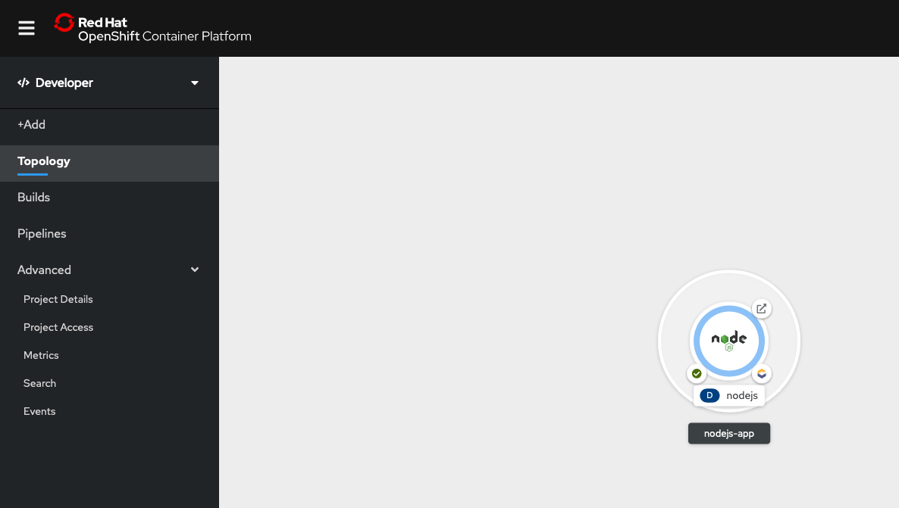


On this view, you can see the name of the application **nodejs-app**, the deployment **nodejs** and the **runtime** Node.js. 

Click in the middle of the **circle**:

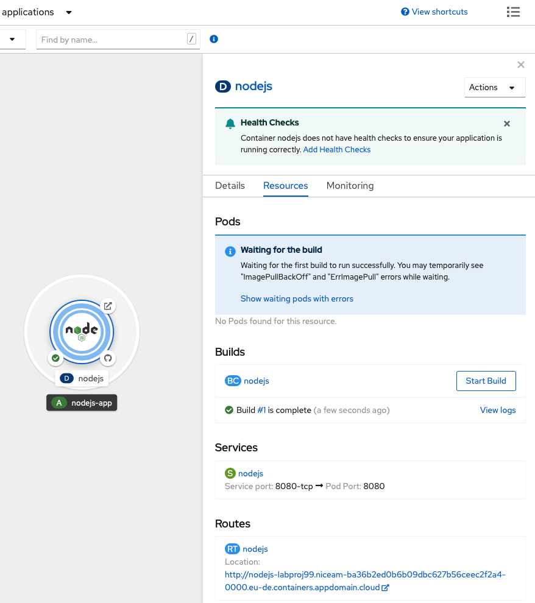


You can now see some details of your application: Pods, Builds, Service and Route.


To get access to your application, you have to find the route: click on  the blue **Route Link** and voilà ! You get access to your application.

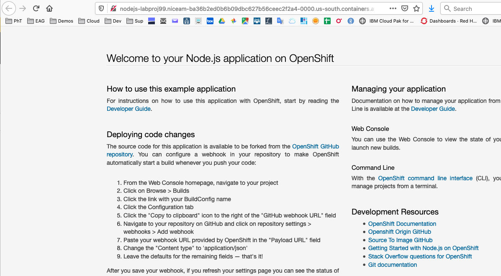


## Task #6 - Delete the application

Be sure you are still working on your **project**<xx> by typing the following command in your terminal:

```bash
oc status
```

Results:

```bash
oc status
In project Testing project for education (labproj99) on server https://c107-e.us-south.containers.cloud.ibm.com:30322

http://nodejs-labproj99.niceam-ba36b2ed0b6b09dbc627b56ceec2f2a4-0000.us-south.containers.appdomain.cloud to pod port 8080-tcp (svc/nodejs)
  deployment/nodejs deploys istag/nodejs:latest <-
    bc/nodejs source builds https://github.com/sclorg/nodejs-ex.git on openshift/nodejs:10-SCL 
    deployment #2 running for 17 minutes - 1 pod
    deployment #1 deployed 18 minutes ago
```

From the web console, you go to your project<xx>

Click on the black button "**A   nodejs-app**" to show the right pane:

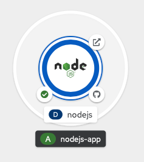

Then click on action and then delete the application:


Then type the name of your application and click delete:

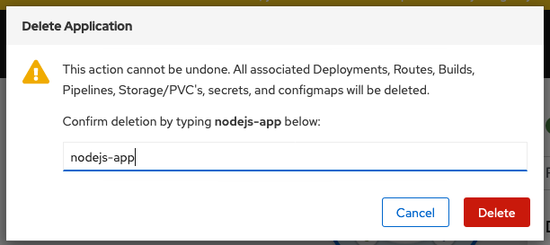

The project should be empty. 

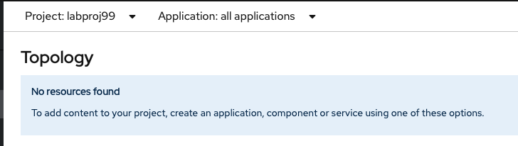


## Task #7 - Starting a new basic application

For this exercise, we will use the CLI and then switch to the OpenShift web console.

We built a basic node.js application using the following GitHub repo that you can see here (thanks to sclorg):

<https://github.com/sclorg/nodejs-ex>

Create a new instance Node.js application based on this GitHub example **(change xx with your number)**

```bash
oc new-app https://github.com/sclorg/nodejs-ex -l name=myapp<xx>
```

After a few seconds:

```bash
oc new-app https://github.com/sclorg/nodejs-ex -l name=myapp99
--> Found image 92fa44e (6 days old) in image stream "openshift/nodejs" under tag "12" for "nodejs"

    Node.js 12 
    ---------- 
    Node.js 12 available as container is a base platform for building and running various Node.js 12 applications and frameworks. Node.js is a platform built on Chrome's JavaScript runtime for easily building fast, scalable network applications. Node.js uses an event-driven, non-blocking I/O model that makes it lightweight and efficient, perfect for data-intensive real-time applications that run across distributed devices.

    Tags: builder, nodejs, nodejs12

    * The source repository appears to match: nodejs
    * A source build using source code from https://github.com/sclorg/nodejs-ex will be created
      * The resulting image will be pushed to image stream tag "nodejs-ex:latest"
      * Use 'oc start-build' to trigger a new build

--> Creating resources with label name=myapp99 ...
    imagestream.image.openshift.io "nodejs-ex" created
    buildconfig.build.openshift.io "nodejs-ex" created
    deployment.apps "nodejs-ex" created
    service "nodejs-ex" created
--> Success
    Build scheduled, use 'oc logs -f bc/nodejs-ex' to track its progress.
    Application is not exposed. You can expose services to the outside world by executing one or more of the commands below:
     'oc expose svc/nodejs-ex' 
    Run 'oc status' to view your app.
#
```


For that exercise, we provided the code (the server.js file in the GitHub and some config files). 

> You can note that OpenShift if going to find itself that the provided code is Node.JS and then find a version 10 that can match this code. Then an image stream is built with the name **nodejs-ex** and stored in the registry. Then after the build, a deployment is done and the application is running with success.  


Track the build log until the app is built and deployed:

```bash
oc logs -f bc/nodejs-ex
```

Results:

```bash
oc logs -f bc/nodejs-ex
Cloning "https://github.com/sclorg/nodejs-ex" ...
	Commit:	a096bd299d65517cef8079f4559e9b0b9f97ff57 (Merge pull request #237 from bparees/nodejs12)
	Author:	Honza Horak <hhorak@redhat.com>
	Date:	Tue Mar 3 16:35:01 2020 +0100
Caching blobs under "/var/cache/blobs".
Getting image source signatures
Copying blob sha256:81aa2695e9554e4aa95038da2bfa0ed5c5c5bc89894b4b6b4835494ebfbad26a
Copying blob sha256:84e620d0abe585d05a7bed55144af0bc5efe083aed05eac1e88922034ddf1ed2
Copying blob sha256:46fc24a071a44b29a3ba49c94f75a47514a56470d539c9204f3e7688973fc93a
Copying blob sha256:455ea8ab06218495bbbcb14b750a0d644897b24f8c5dcf9e8698e27882583412
Copying blob sha256:bb13d92caffa705f32b8a7f9f661e07ddede310c6ccfa78fb53a49539740e29b
Copying config sha256:3e32112e4287d3f7253b2c1c177de3270e5aed79704a1c6dd0106a7ef35bf5f0
Writing manifest to image destination
Storing signatures
Generating dockerfile with builder image image-registry.openshift-image-registry.svc:5000/openshift/nodejs@sha256:3969e466985c863267bfa75c5c8bcdc9f3560cf5413c16530307013e486ba71c
STEP 1: FROM image-registry.openshift-image-registry.svc:5000/openshift/nodejs@sha256:3969e466985c863267bfa75c5c8bcdc9f3560cf5413c16530307013e486ba71c
STEP 2: LABEL "io.openshift.build.commit.date"="Tue Mar 3 16:35:01 2020 +0100" "io.openshift.build.commit.id"="a096bd299d65517cef8079f4559e9b0b9f97ff57" "io.openshift.build.commit.ref"="master" "io.openshift.build.commit.message"="Merge pull request #237 from bparees/nodejs12" "io.openshift.build.source-location"="https://github.com/sclorg/nodejs-ex" "io.openshift.build.image"="image-registry.openshift-image-registry.svc:5000/openshift/nodejs@sha256:3969e466985c863267bfa75c5c8bcdc9f3560cf5413c16530307013e486ba71c" "io.openshift.build.commit.author"="Honza Horak <hhorak@redhat.com>"
STEP 3: ENV OPENSHIFT_BUILD_NAME="nodejs-ex-1" OPENSHIFT_BUILD_NAMESPACE="labproj99" OPENSHIFT_BUILD_SOURCE="https://github.com/sclorg/nodejs-ex" OPENSHIFT_BUILD_COMMIT="a096bd299d65517cef8079f4559e9b0b9f97ff57"
STEP 4: USER root
STEP 5: COPY upload/src /tmp/src
STEP 6: RUN chown -R 1001:0 /tmp/src
STEP 7: USER 1001
STEP 8: RUN /usr/libexec/s2i/assemble
---> Installing application source ...
---> Installing all dependencies
npm WARN deprecated jade@0.26.3: Jade has been renamed to pug, please install the latest version of pug instead of jade
npm WARN deprecated mkdirp@0.5.1: Legacy versions of mkdirp are no longer supported. Please update to mkdirp 1.x. (Note that the API surface has changed to use Promises in 1.x.)
npm WARN deprecated to-iso-string@0.0.2: to-iso-string has been deprecated, use @segment/to-iso-string instead.
npm WARN deprecated mkdirp@0.3.0: Legacy versions of mkdirp are no longer supported. Please update to mkdirp 1.x. (Note that the API surface has changed to use Promises in 1.x.)
npm WARN deprecated minimatch@0.3.0: Please update to minimatch 3.0.2 or higher to avoid a RegExp DoS issue

> ejs@2.7.4 postinstall /opt/app-root/src/node_modules/ejs
> node ./postinstall.js

Thank you for installing EJS: built with the Jake JavaScript build tool (https://jakejs.com/)

npm notice created a lockfile as package-lock.json. You should commit this file.
added 121 packages from 342 contributors and audited 205 packages in 6.346s
found 10 vulnerabilities (3 low, 2 moderate, 4 high, 1 critical)
  run `npm audit fix` to fix them, or `npm audit` for details
---> Building in production mode
---> Pruning the development dependencies
audited 205 packages in 1.139s
found 10 vulnerabilities (3 low, 2 moderate, 4 high, 1 critical)
  run `npm audit fix` to fix them, or `npm audit` for details
/opt/app-root/src/.npm is not a mountpoint
---> Cleaning the npm cache /opt/app-root/src/.npm
/tmp is not a mountpoint
---> Cleaning the /tmp/npm-*
STEP 9: CMD /usr/libexec/s2i/run
STEP 10: COMMIT temp.builder.openshift.io/labproj99/nodejs-ex-1:cf141784
Getting image source signatures
Copying blob sha256:35817540a17b5b90cb4426078d53813b16e70c75e1cce3db116d2fbbca7fbf10
Copying blob sha256:c7fbe90ae90e9c6452e5d809f069907907e6f32532565104921f600fb956306c
Copying blob sha256:74d760a83a4b8bcb3d01e7726e06c11469f0bb2ce4645474cb91a607c27bf482
Copying blob sha256:84ecc5257b90d8d8b51cf749f244f3b7b5d949e4d2761f7522bebd81f07d2ecb
Copying blob sha256:2a72856523ed3830ed849bc9ce8cccc7da245495fabea7b26d2b838f4ed02ce3
Copying blob sha256:1a2f0fb94c4b01cdbdc80cdbc9d1ab8a6260e9f7181a25f533df663ab5cada76
Copying config sha256:752c0f078cb800ae28e113a82c476517cdd1f5aa55f59356a1a99c03296fbb1b
Writing manifest to image destination
Storing signatures
752c0f078cb800ae28e113a82c476517cdd1f5aa55f59356a1a99c03296fbb1b
752c0f078cb800ae28e113a82c476517cdd1f5aa55f59356a1a99c03296fbb1b

Pushing image image-registry.openshift-image-registry.svc:5000/labproj99/nodejs-ex:latest ...
Getting image source signatures
Copying blob sha256:84e620d0abe585d05a7bed55144af0bc5efe083aed05eac1e88922034ddf1ed2
Copying blob sha256:455ea8ab06218495bbbcb14b750a0d644897b24f8c5dcf9e8698e27882583412
Copying blob sha256:bb13d92caffa705f32b8a7f9f661e07ddede310c6ccfa78fb53a49539740e29b
Copying blob sha256:46fc24a071a44b29a3ba49c94f75a47514a56470d539c9204f3e7688973fc93a
Copying blob sha256:81aa2695e9554e4aa95038da2bfa0ed5c5c5bc89894b4b6b4835494ebfbad26a
Copying blob sha256:1a2f0fb94c4b01cdbdc80cdbc9d1ab8a6260e9f7181a25f533df663ab5cada76
Copying config sha256:752c0f078cb800ae28e113a82c476517cdd1f5aa55f59356a1a99c03296fbb1b
Writing manifest to image destination
Storing signatures
Successfully pushed image-registry.openshift-image-registry.svc:5000/labproj99/nodejs-ex@sha256:081f42b26e27d2308ea444f4cc4e50fd9bb953977d58245bfecc13d61d9a97a2
Push successful

```


If you are familiar with Git, Docker and Kubernetes, you will notice several activities:

- a clone of the github repo 
- npm (because it is a Node.js source) is used to solve the library dependencies. 
- Finally a docker container image is built and stored in the OpenShift registry (push)

To check that your application is running:

```bash
oc get pods
```

Results:

```bash
# oc get pods
NAME                         READY   STATUS      RESTARTS   AGE
nodejs-ex-1-build            0/1     Completed   0          101s
nodejs-ex-6df7ccf8bc-p5m8b   1/1     Running     0          35s
```


You will notice that one pod (job) has been completed for the **build** stage.

The other pod is running (1/1) and this is our Node.JS application.

To make this application visible to the world, you should create a **route**. If you are familiar with Kubernetes, a route is very close concept of an ingress with the association of a DNS. 

Expose a route to the service:

```
oc expose svc/nodejs-ex
```

Results:

```bash
# oc expose svc/nodejs-ex
route.route.openshift.io/nodejs-ex exposed
```

But you don't know the route url yet. 

```bash
oc get route
```

Results

```
# oc get route
NAME        HOST/PORT                                        PATH      SERVICES    PORT       TERMINATION   WILDCARD
nodejs99    nodejs99-labproj99.niceam-ba36b2ed0b6b09dbc627b56ceec2f2a4-0000.us-south.containers.appdomain.cloud           nodejs99    8080-tcp                 None

```

Now you get the url. Sample results:

``` 
http://nodejs99-labproj99.niceam-ba36b2ed0b6b09dbc627b56ceec2f2a4-0000.us-south.containers.appdomain.cloud
```

You can notice the following :

- the url contains the project name **labproj<xx>** and the name of your application **nodejs**<xx>
- and also the OpenShift hostname (in that case **niceam-ba36b2ed0b6b09dbc627b56ceec2f2a4-0000** ) 
- using  IBM Cloud domain name **us-south.containers.appdomain.cloud**


Get access to this new application using this URL:

Example:

!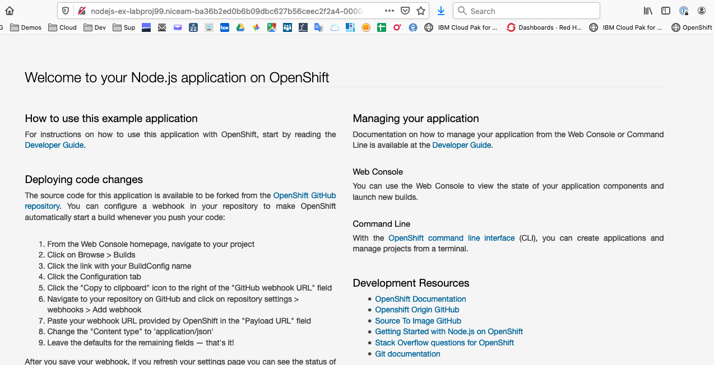


## Conclusion

**Congrats !!!**  You successfully installed and used the oc CLI and the OpenShift web console thru the installation of a typical Node.JS application (from Github). 

You noticed the following details:

- easy to access the OpenShift web console
- easy to build and deploy the application, the container, the pod.
- the route concept
- the Deployment
- the wildcard DNS utilization in routes
- the S2I concepts to build the docker image


----
# End of Lab


