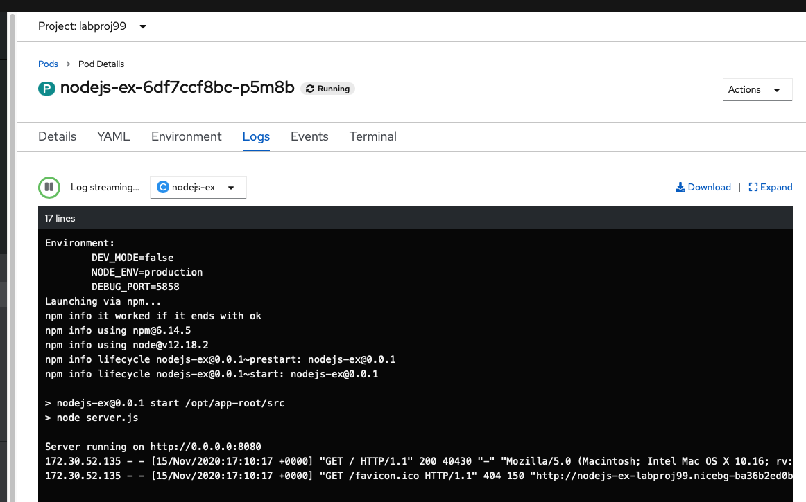
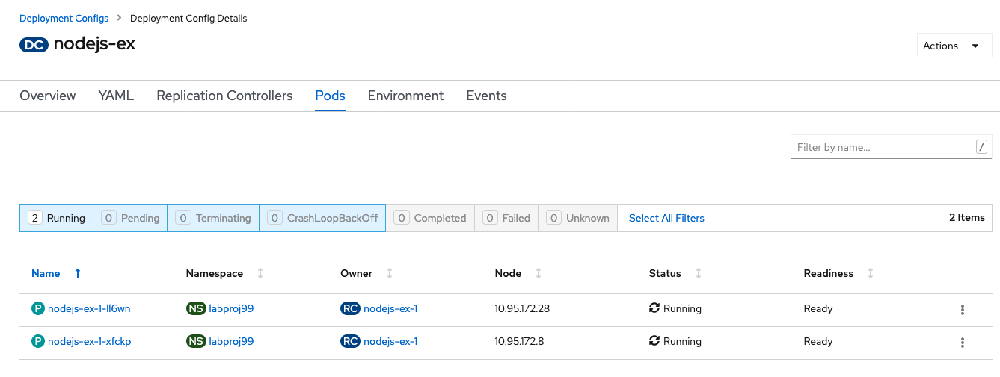
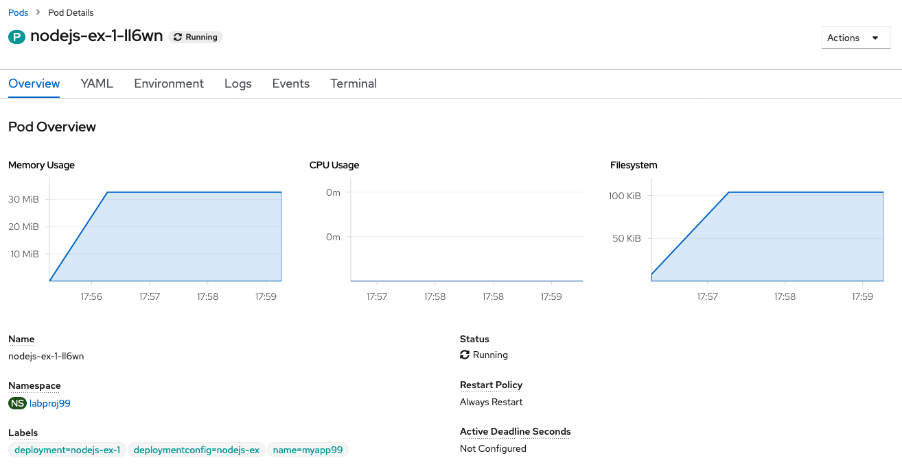
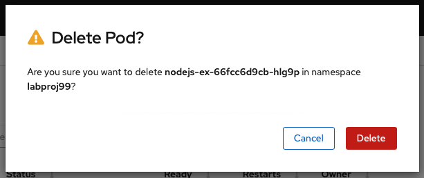

# OpenShift Admin Lab

Duration: 30 minutes

##  Introduction

This lab is the continuation of the first OpenShift Lab. During this new lab, we are going to concentrate on the cluster administrator work like managing the pods, nodes, versions, CRDs, monitoring, scaling ...

## Task #8 - OpenShift Administrator Console

If you are still on the **Developer** side, move to the **Administrator**.

You will a screen like this one:

The Dashboard (Overview) is very interesting and very popular for troubleshooting. 

Notice the following cards : first the **Details** where you can check the OpenShift **version** and if you can update to a newer version. 

Then the **Cluster Inventory** : This is were you can check the different resources (like nodes or pods and storage). If you have a red point near Pods, then you will be quickly drill down to the **failling** or suspended pod(s). 

In the Status, you will see if the different components (like operators) in the cluster are healthy or not:

The **Cluster Utilisation** is very important to see how your Pods are consumming the infrastructure resources like CPU, RAM, storage, bandwidth ...

Finally, one most important componant in Kubernetes : the **event** messages ! All Kubernetes events are shown in one place and this very helpfull is you want to analyse and quickly identify issues, error or impacting problems. 

So to summarize, in one dashboard overview, you can quickly analyze the situation and find a solution for a specific issue. 

## Task #9 - Projects and Workloads

Now move to the **projects** : as the cluster administrator, you can view all the projects (namespaces) in the cluster (normally the developers just see their own namespace). Click on you **labproj**<xx>

This brings you to this overview but specifically for this **project** (labprojxx). 

The Dashboard of your labproj<xx> is very interesting because you can see a lot of informations: 

- Inventory of OpenShift objects like Pods, Deployments, Services ...

- Status (if some errors) for the project

- Utilization (CPU, Memory ...) for the project

- Activity (from the events) for the resources in that project

- Quotas

Now drill down to the Pods to look at the **Pods** in Inventory in your **labproj**<xx>:

On the left pane, click on the **Deployment**

Let's click on that specific **deployment**. A deployement contains the **replicasets**, the **pods**, the **quotas** ...

The **YAML definition** represents the definition of the deployment. In recent versions of Kubernetes, you will see a lot new rows (like the **fieldsType**). fieldsType are added automatically to help to understand how Kunetrnetes is working. Unfortunately, this doesn't add clarity to read the yaml definition. 

If you browse the YAML file at the **end of the file**, you will see the POD specifications and the **image** of the container:

The **Replica Sets** Tab will show you the number of replicas that we started (one here)

Finally the **Events** Tab (this log of events is concerning the activity around the deployment of the Pods):

## Task #10 - Into the PODs

Now from the deployment, click on the **Pods** tab.  And you might see 2 PODs : one for the **build** (S2I) and the other concerning the running node.js **application**. 

You can notice that you have one pod that is running. **Click on that Pod**:

At the bottom of that page, you will see the list of **containers** and **volumes**

Now click in the **log** (concerning the application) :

And then finally, click on the Terminal Tab to get access **inside the container** (try typing several linux commands like ps or ls):

## Task #11 - Scaling your application

One important task of the cluster administrator is to manage the workload and to be able to increase the number of PODs when the number of requests is becoming more important. 

To learn about scaling your application, on the left pane, click on the **Deployment** and then click on your specific deployment:

Finally, increase the number of pods (**not too much**: 2 for instance)

And after a while, you will see 2 active pods.

This means that now 2 pods are serving the requests behind the same kubernetes service. And all the requests will go in round robin automatically on one or the other pods.  

Now click on one of these new **pods** and you should see a page like this one showing new activity:

Now go back to the **list of PODs** (click on Pods on the left pane):

Let's try a crazy experience and kill a pod ! click on the three dots at the end of the row and select `delete Pod`

The following popup window will appear:

Click on `Delete` and you should see breifly your pod terminating.

A new pod is **automatically started** !!! Because the number of **replicaset** has been defined to **2** , even if a pod is crashing or has been deleted, it will be replace automatically by a new one. 

## Task #12 - Monitoring your cluster

In Openshift, out of the box, you have a Prometheus server and a Grafana server that you can access from the OpenShift web Console. 

Click on the **Monitoring** section on the left pane and then click on **Dashboards**:

No data is collected for ETCD so the dashboard is empty.

Select a different dashboard in the list: Select the Cluster dashboard:

Then you will see this page with global metrics (CPU, RAM, Network, and commitments). Browse the page:

Then move your cursor to a graph to show specific metrics:

You can explore some other dashboards from the list:

You can also go to **Grafana UI**:

Click **Home > Default**

Pick one graph in the list:

## Task #13 - Cluster Administration

From the left pane, click on **Cluster Settings**:

In this section, you can upgrade the cluster version to a newer one (no update at the moment):

To look at the different **Custom Resource Definitions** (CRD) : 

CRDs are generaly used in **Operators**. 

Go to **OperatorHub** to list all possible Operator that you can install  on your cluster:

Most of the solutions are installed by using operators. Each operator corresponds to a specific solution or application. Operators propose **5 levels of capabilities** that you can on the left side of this page :

 

Find the `Web Terminal`operator :

Click on the Web Terminal tile to see the details of the installation :

**Do not install** ...

Close the window and go back to the OpenShift Console

## Task #14 - Storage and Networking

On the left pane, **Click on Storage > Persistent Volume Claim** 

You should see the **internal OpenShift registry**.  Then click on the **Persistent Volume**.

You can see the storage size by default for the internal registry : **100 Go**. This storage has been booked using a storage class (**ibmc-file-gold**). The status is `bound`. 

Now move to the **Networking** section and look at you service in the **labproj**<xx>

Drill down to the **service name:**

Drill down to the **PODs** associated to this service:

## Conclusion

**Congrats !!!**  You successfully used the console to manage your cluster !!

You noticed the following details:

- the console facilitates the administrator work
- it is easy to change the cluster to a new version 
- it is easy to drill down to troubleshoot any issue by looking at the event or at the logs
- you can even go inside a container easily
- the monitoring tool is everywhere in the console and you can also go in Grafana.
- Operators facilitate the installation of a lot of different opensource software
- Everything can be done thru the console

----

----

# End of Lab

